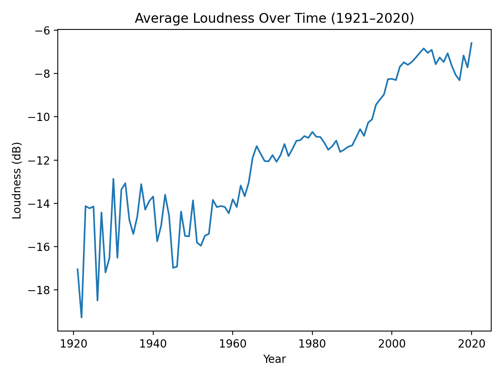
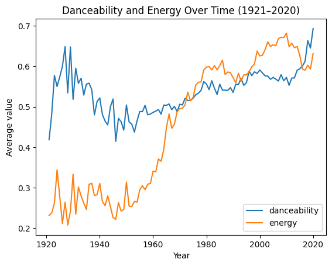

# music-eda-spotify-1921-2020

Exploratory data analysis of Spotify audio feature trends from **1921–2020** using a Kaggle dataset.  
Focus: how high-level audio characteristics (e.g., loudness, energy, danceability) shift over time.

> Note: The dataset files are not included in this repo. See `data/README.md` for download + placement instructions.

## Key findings (high level)

- **Average loudness rises substantially over the century**, with noticeably higher year-to-year volatility in the early decades—likely influenced by lower dataset coverage in the 1920–1950 period.
- **Energy trends upward over time**, with a pronounced increase beginning mid-century, while **danceability** shows a gentler upward shift. (These are Spotify-derived audio feature scores, so treat them as model-based proxies rather than objective measures.)
- **Tempo increases modestly** across the period, while **valence** stays comparatively stable. Because tempo (BPM) and valence (0–1) live on very different scales, it’s best to visualize them with separate axes or separate plots.

## Project structure

- `data/` — instructions for obtaining the dataset (data files not tracked)
- `notebooks/` — analysis notebook(s)
- `src/` — reusable helper functions (cleaning/plotting, etc.)
- `outputs/figures/` — saved plots for quick viewing

## How to run

1. Create a virtual environment and install dependencies:

   ```bash
   python3 -m venv .venv
   source .venv/bin/activate
   pip install -r requirements.txt
   ```

2. Download the dataset and place CSVs in `data/raw/` (see `data/README.md`).

3. Launch Jupyter and run the notebook:

   ```bash
   jupyter notebook
   ```

   Open `notebooks/01_eda.ipynb` and run the cells top-to-bottom.

## Figures

Saved plots (generated by the notebook) are placed in `outputs/figures/`.





## Notes on interpretation

Spotify audio features (e.g., energy, valence, danceability) are derived from audio analysis models and normalized to 0–1.  
They’re useful for trend exploration, but they are not objective ground truth about emotion or quality.
